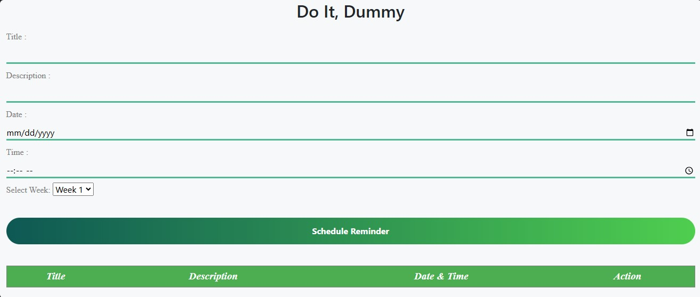
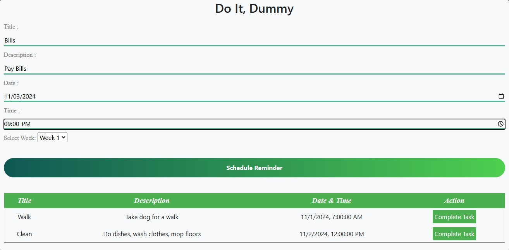
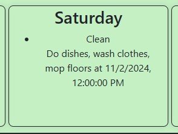

# DO IT, DUMMY! CALENDAR

## INTRODUCTION
The Witty Calendar is a fun, snarky way to track tasks and important dates that a regular calendar cannot provide.
Most calendars only provide the ability to jot a date, time, and the task to remember.
The Witty Calendar provides users with the motivation to complete their tasks on time.
Because if they miss their due date, they will be insulted.
Not only does the calendar keep users motivated, but it is also entertaining.

## REQUIREMENTS
- Must have an internet connection to access the website.
- User must have a task that has a set deadline.
- The user must have a task that is due within the next 2 weeks.  The calendar is currently limited to a 2-week period for adding tasks.

## INSTALLATION
There is no installation required for this application. The user can access the URL via their preferred web browser and use the application.

## CONFIGURATION
There is no configuration required for this application.

## INSTRUCTIONS ON HOW TO USE
### ADD A NEW TASK
- Access the webpage at ' '.

- Provide a "Title" for your task.
- Provide a description of the task you wish to schedule and complete.
- Pick a date to complete the task by. NOTE: The date must be within the next 14 days.
- Pick a time to complete the task.  NOTE: The format is currently in HH:MM:AM/PM.  If no value is provided this will default to 12:00 AM.
- Select either week 1 (for your current week) or week 2 (for the next week).

- Click the "Schedule Reminder" button.

### MARK A TASK AS COMPLETED
- After a task has been created, it will display in the "Scheduled Tasks" grid, which is located directly below the inputs section.
- Locate your task and click the "Complete Task" button.
- You'll receive a confirmation message of "Congratulations! Maybe you aren't a complete idiot!!".

## EXPAND THE TASKS IN THE WEEKLY CALENDAR section
- After creating a task, scroll down to the "Weekly Calendar" section, and locate your task by the day of the week you assigned it and by the title you provided.
- Click on the "Title" of the task and it will expand to show "Description" and "Due Date/Time".

## FAQ
- How do I add a new task to my calendar? Populate the Title, Description, Date, and Time fields.  Then click the "Schedule Reminder" button.
- How do I mark an item for completion? After a task has been added, locate the task, and click the "Complete" button under the "Action" column.
- Can I schedule a task beyond 2 weeks from my current date? Currently, the app does not have the ability to add tasks beyond a 2-week window.
- How many possible insults are there for the calendar? There are currently 5 possible insults that will pop up.
- How are insults selected to be displayed?  The Witty Calendar application randomly picks an insult to display when a user misses completing a task on time.